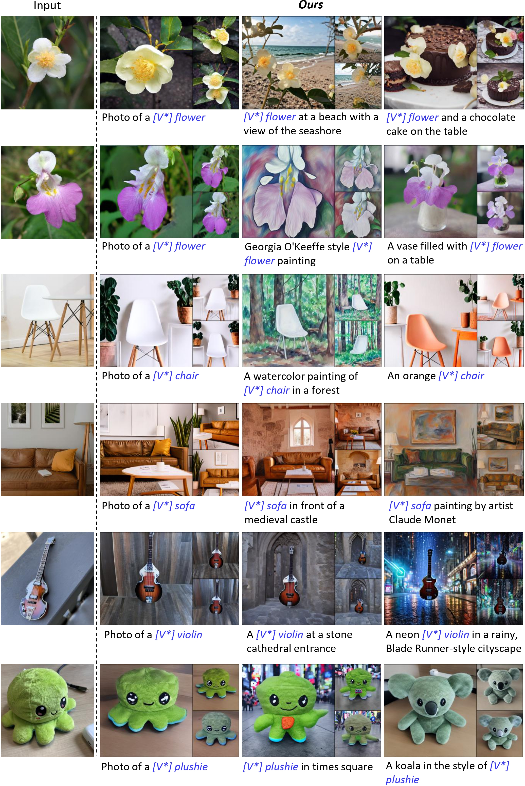

# OPAD: Adversarial Concept Distillation for One-Step Diffusion Personalization

<p align="center">
  Yixiong Yang<sup>1,*</sup>, Tao Wu<sup>2,*</sup>, Senmao Li<sup>3</sup>, Shiqi Yang<sup>3,†</sup>,<br>
  Yaxing Wang<sup>3</sup>, Joost van de Weijer<sup>2</sup>, Kai Wang<sup>4,5,2,✉</sup>
</p>

<p align="center">
  <sup>1</sup>Harbin Institute of Technology (Shenzhen), China &nbsp;
  <sup>2</sup>Computer Vision Center, Universitat Autònoma de Barcelona, Spain<br>
  <sup>3</sup>VCIP, CS, Nankai University, China &nbsp;
  <sup>4</sup>City University of Hong Kong (Dongguan), China &nbsp;
  <sup>5</sup>City University of Hong Kong, HK SAR, China
</p>

<p align="center">
  <sup>*</sup>Equal contribution. &nbsp; <sup>†</sup>Visiting researcher in Nankai University. &nbsp; <sup>✉</sup>Corresponding author.
</p>

<p align="center">
  <a href="https://liulisixin.github.io/OPAD/">Project Page</a> |
  <a href="https://arxiv.org/abs/2510.20512">arXiv</a>
</p>

Official implementation for **OPAD**.


Overview of OPAD. The student and teacher jointly learn the new concept with a shared text encoder. The teacher learns from real images (green), and the text encoder is updated accordingly. The student is optimized with two objectives (gold): an adversarial loss to match real data distribution and alignment losses to match the denoised outputs of the teacher. The discriminators are trained to distinguish between the student's outputs and real images.

## Environment

```bash
conda create -n opad python=3.10 -y
conda activate opad

pip install torch==2.1.0 torchvision==0.16.0 torchaudio==2.1.0 --index-url https://download.pytorch.org/whl/cu121
pip install diffusers==0.26.0 huggingface-hub==0.25.2 transformers==4.28.0
pip install peft==0.7.0 lpips==0.1.4 wandb==0.19.8 accelerate==1.5.2 safetensors==0.5.3 timm==1.0.11 einops==0.8.1
pip install matplotlib scipy scikit-learn pandas opencv-python==4.11.0.86 numpy==1.24.4
pip install git+https://github.com/openai/CLIP.git
pip install git+https://github.com/tencent-ailab/IP-Adapter.git
```

OPAD uses Weights & Biases for training logs. The default student model is `stabilityai/sd-turbo`. The teacher model is currently set to `sd2-community/stable-diffusion-2-1`; Stable Diffusion 2.1 model paths on Hugging Face may change, so please update `--teacher_pretrained_model_name_or_path` if needed.

Download the [IP-Adapter](https://github.com/tencent-ailab/IP-Adapter) weights and pass the image encoder and checkpoint paths to the training command. The examples below use `/path/to/IP-Adapter`; replace it with your local IP-Adapter folder.

Model downloads are cached by Hugging Face. To keep cache files outside the default home directory, set `HF_HUB_CACHE`, `TRANSFORMERS_CACHE`, and `TORCH_HOME` before running training or inference.

## Data

Download the DreamBooth dataset and keep its original folder layout:

```bash
git clone https://huggingface.co/datasets/google/dreambooth ../dreambooth
```

For the dog example, images should be available at:

```text
../dreambooth/dataset/dog/*.jpg
```

## Train One Instance

Edit the IP-Adapter paths in `train.sh`, then run the dog example with:

```bash
bash train.sh
```

Equivalent command:

```bash
python train_opad.py \
  --instance_data_dir=../dreambooth/dataset/dog \
  --output_dir=outputs/opad_dog/dog \
  --instance_prompt="<new1> dog" \
  --modifier_token="<new1>" \
  --initializer_token=corgi \
  --validation_prompt="a <new1> dog in the jungle" \
  --ip_adapter_image_encoder_path=/path/to/IP-Adapter/models/image_encoder \
  --ip_adapter_ckpt=/path/to/IP-Adapter/models/ip-adapter_sd15.bin
```

## Inference

Generate personalized images from the trained checkpoint:

```bash
python inference_opad.py \
  --model_path outputs/opad_dog/dog \
  --output_path outputs/opad_dog/dog/inference/grid.png
```

You can also provide prompts directly:

```bash
python inference_opad.py \
  --model_path outputs/opad_dog/dog \
  --output_path outputs/opad_dog/dog/inference/custom.png \
  --prompt "a <new1> dog in the jungle" "a <new1> dog wearing a red hat"
```

## DreamBooth Batch

Run all DreamBooth instances listed in `run_dreambooth.py`:

```bash
python run_dreambooth.py \
  --output_folder outputs/opad_dreambooth \
  --train_file train_opad.py \
  --data_dir ../dreambooth/dataset \
  --ip_adapter_image_encoder_path=/path/to/IP-Adapter/models/image_encoder \
  --ip_adapter_ckpt=/path/to/IP-Adapter/models/ip-adapter_sd15.bin
```


## Optional DreamBooth Evaluation

`eval_dreambooth.py` is kept as an optional utility for DreamBooth prompt generation and quantitative metrics:

```bash
python eval_dreambooth.py \
  --path outputs/opad_dog \
  --instances dog \
  --dreambooth_path ../dreambooth/dataset \
  --outdir benchmarks
```

Text-image metrics such as `clip-t` and `vqa` require the optional `t2v-metrics` package (borrow from [TextBoost](https://github.com/nahyeonkaty/textboost)). Install it only when computing full-dataset quantitative results.

## Some Qualitative Results



## Citation

```bibtex
@inproceedings{yang2026adversarial,
  title     = {Adversarial Concept Distillation for One-Step Diffusion Personalization},
  author    = {Yixiong Yang and Tao Wu and Senmao Li and Shiqi Yang and Yaxing Wang and Joost van de Weijer and Kai Wang},
  booktitle = {Proceedings of the IEEE/CVF Conference on Computer Vision and Pattern Recognition (CVPR) Findings},
  year      = {2026}
}
```

## License

Licensed under a [Creative Commons Attribution-NonCommercial 4.0 International](https://creativecommons.org/licenses/by-nc/4.0/) for non-commercial use only. Any commercial use should get formal permission first.

## Acknowledgement

This codebase builds on and refers to [Custom Diffusion](https://github.com/adobe-research/custom-diffusion) and [TextBoost](https://github.com/nahyeonkaty/textboost). We thank the authors for their kind sharing.
